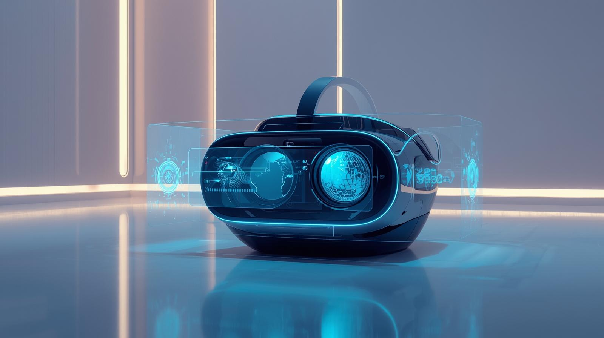

# VR180 3D Video Generator

Convert standard 2D videos into immersive VR180 stereoscopic videos using AI-powered depth estimation.


## Project Overview

This project provides a complete pipeline to convert 2D videos into VR180 format videos by estimating depth maps from each frame using a deep learning model and generating stereoscopic left and right eye frames. The output is a side-by-side encoded VR180 video suitable for viewing on VR headsets that support this format.

---

## Features

- Upload 2D videos in mp4, mov, avi formats.
- Frame extraction using OpenCV.
- AI-driven depth estimation with MiDaS model (PyTorch).
- Stereo frame generation with pixel shift based on depth.
- Video reassembly into side-by-side VR180 format.
- Streamlit-based interactive web interface.
- Progress visualization and file download support.
- Automatic resource and temporary file management.
- GPU acceleration support if available.

---

## Installation

### Prerequisites

- Python 3.8 or higher
- GPU with CUDA support (optional but recommended for speed)
- FFmpeg installed and available in system PATH

### Installation Steps

1. Clone the repository:
```
git clone <repository-url>
cd vr180-video-generator
```


2. Create and activate a virtual environment (optional but recommended):

```
python -m venv venv
source venv/bin/activate # Linux/Mac
venv\Scripts\activate # Windows
```


3. Install dependencies:

```
pip install -r requirements.txt
```


4. Ensure FFmpeg is installed:

- Check with `ffmpeg -version`
- Install from https://ffmpeg.org/download.html if missing

---

## Usage

### Run the Streamlit App

```
streamlit run app_streamlit.py
```


### How to Use

1. Open the URL printed by Streamlit in your browser.
2. Upload a 2D video in supported formats (mp4, mov, avi).
3. Click "Convert to VR180".
4. Wait as the app extracts frames, estimates depth, creates stereo pairs, and generates the output video.
5. Preview the VR180 video in browser.
6. Download the processed VR180 video using the download button.

---

## Project Structure

```
vr180-video-generator/
│
├── app_streamlit.py # Streamlit UI and main pipeline
├── depth_estimator.py # Depth estimation using MiDaS model
├── stereo_renderer.py # Stereo frame creation from RGB and depth
├── utils.py # Helper functions: frame extraction, video creation
├── requirements.txt # Python dependencies and versions
├── static/
│ └── 2D_to_VR180.jpg # Banner image displayed in the app
├── uploads/ # Temporary uploaded videos
├── frames/ # Extracted input frames from video
├── left_frames/ # Generated left stereo images
├── right_frames/ # Generated right stereo images
├── processed/ # Final VR180 processed videos
└── README.md # Project documentation
```


---

## Technical Details

- **Depth Estimation**:
  - Uses PyTorch Hub’s MiDaS small model.
  - Input RGB frames transformed and fed into the model.
  - Output depth maps normalized for consistent stereo shift computation.

- **Stereo Frame Generation**:
  - Each pixel shifted horizontally proportional to depth and fixed eye separation (15 px).
  - Pixels displaced right for the left-eye image and left for right-eye image.
  - Generates left and right images that simulate human binocular vision.

- **Video Processing**:
  - Frames extracted with OpenCV, saved as PNGs.
  - Left and right frames combined side-by-side horizontally using NumPy and OpenCV.
  - Output video temporary saved before being converted to H.264 format with FFmpeg for compatibility.

- **Streamlit UI**:
  - Intuitive interface with file uploader, progress bars, and download links.
  - Feedback and error messages for unsupported formats.
  - Automatic cleaning and preparation of processing folders.

---

## Model and Algorithms

- **MiDaS Model**:
  - Pretrained on multiple datasets covering diverse scenes.
  - Provides dense depth predictions from monocular images.
  - Lightweight MiDaS small variant balances accuracy and speed.

- **Stereo Rendering Algorithm**:
  - Uses pixel-depth map product to calculate stereo disparity.
  - Simple horizontal pixel shifting simulates eye views.
  - Does not currently handle occlusion filling or complex parallax.

---

## Dependencies

Key Python packages include:

- torch
- torchvision
- streamlit
- opencv-python-headless
- pillow
- numpy
- tqdm

FFmpeg is required for video encoding outside Python.

See `requirements.txt` for full list with versions.

---

## Future Improvements

- Add support for real-time video streaming conversion.
- Improve stereo frame synthesis with occlusion-aware inpainting.
- Enable user control for eye separation distance and depth exaggeration.
- Support more VR formats such as full 360-degree videos.
- Optimize processing for high-resolution HD videos.
- Deploy scalable cloud solution with GPU acceleration.

---

## Troubleshooting

- **FFmpeg errors**: Ensure FFmpeg is installed and in your system PATH. Check by running `ffmpeg -version`.
- **CUDA not detected**: Verify your GPU drivers and CUDA toolkit installation.
- **Unsupported file format error**: Upload supported video extensions only: mp4, mov, avi.
- **Performance issues**: Processing large videos may require GPU; use smaller clips to test.

---

## License

This project is provided under [MIT License](LICENSE). Feel free to use and modify with attribution.

---

## Contact

For questions or contributions, please open an issue or pull request on GitHub.

---

Thank you for using the 2D to VR180 Video Generator! Enjoy immersive VR experiences from your 2D videos.


